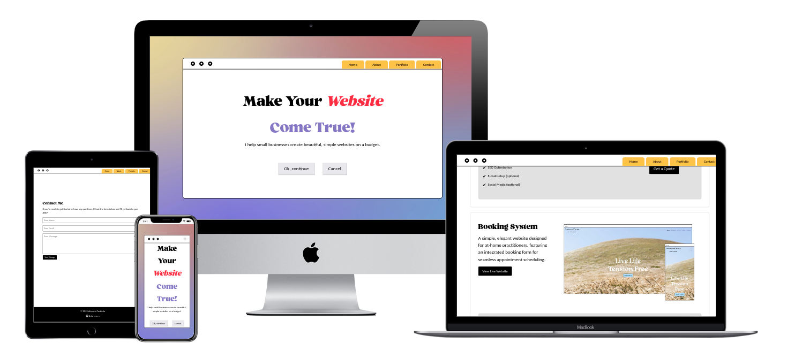

# Ariane Saulnier - Portfolio Website

## Overview
This is ny personal portfolio website, showcasing my skills and services. The website is aimed at helping small business owners build simple, budget-friendly websites. The design is responsive, modern, and includes a video background, animations, and interactive components.



[Live website](https://aria-vero-s.github.io/portfolio/)

## Features

### General
- **Responsive Design**: Optimized for all screen sizes.
- **Bootstrap Integration**: Ensures a clean, grid-based layout.
- **Modern Design**: Video background and smooth animations enhance visual appeal.
- **Font Awesome Icons**: For visually appealing and functional design elements.

### Sections
1. **Hero Section**:
   - Engaging tagline: "Make Your Website Come True!"
   - Call-to-action buttons for user interaction.

2. **About Section**:
   - Introduction of Ariane Saulnier and her mission to help small businesses.
   - Highlights education and professional experience.

3. **Services Section**:
   - A detailed list of services offered, such as website development, hosting setup, branding, SEO, and social media guidance.

4. **Portfolio Section**:
   - Showcases completed projects with descriptions and links to live demos.
   - Includes pricing and package details for potential clients.

5. **Contact Section**:
   - Integrated contact form created with [formspree](http://www.formspree.io) enabling users to reach out for quotes or inquiries.

## Technologies Used
- **HTML5**: Markup structure.
- **CSS3**: Custom styles and animations.
- **Bootstrap 4 & 5**: Responsive grid system and components.
- **JavaScript**: For interactivity (optional; to be integrated in future iterations).
- **Font Awesome**: Icons for enhanced design.
- **Video Background**: Adds a dynamic and engaging visual element.

## How to Run the Project
1. **Clone the Repository**:
   ```bash
   git clone https://github.com/aria-vero-s/portfolio.git
   ```

2. **Navigate to the Project Directory**:
   ```bash
   cd portfolio
   ```

3. **Open in Browser**:
   Open the `index.html` file in your browser to view the website.

### How to Set Up the Form

1. Make sure to replace the Formspree action URL in the HTML form:
    ```html
    <form id="contact-form" action="https://formspree.io/f/xrbbolzo" method="POST">
    ```
    with:
    ```html
    <form id="contact-form" action="https://formspree.io/f/YOUR_FORM_ID" method="POST">
    ```

2. Replace `YOUR_FORM_ID` with your actual Formspree form ID. You can obtain this ID by signing up at [Formspree](https://formspree.io/) and creating a new form.

3. Once the change is made, the form will send submission data to your email.

## Project Structure
```
|-- index.html
|-- styles.css
|-- animations.css
|-- script.js
|-- ashford-italic.otf
|-- ashford.otf
|-- background.mp4
|-- images/
|   |-- mockup1.jpg
|   |-- mockup2.jpg
|   |-- mockup3.jpg
|-- assets/
|   |-- bootstrap.min.css
|   |-- fontawesome.js
```

## Credits
- **Video**: [Gradient Background](https://www.pexels.com/video/gradient-background-7898649/) from Pexels.  
- **Font**: [Ashford Font](https://www.allfreefonts.co/ashford-font/) from All Free Fonts.

## Future Enhancements
- **French Translation**: Add a translation button in the navbar.
- **SEO Optimization**: Improve metadata and structure for better search engine ranking.
- **Dark Mode**: Provide an option for users to toggle between light and dark themes.

---

Thank you for visiting my portfolio website!

